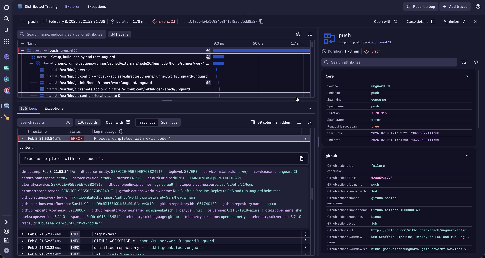
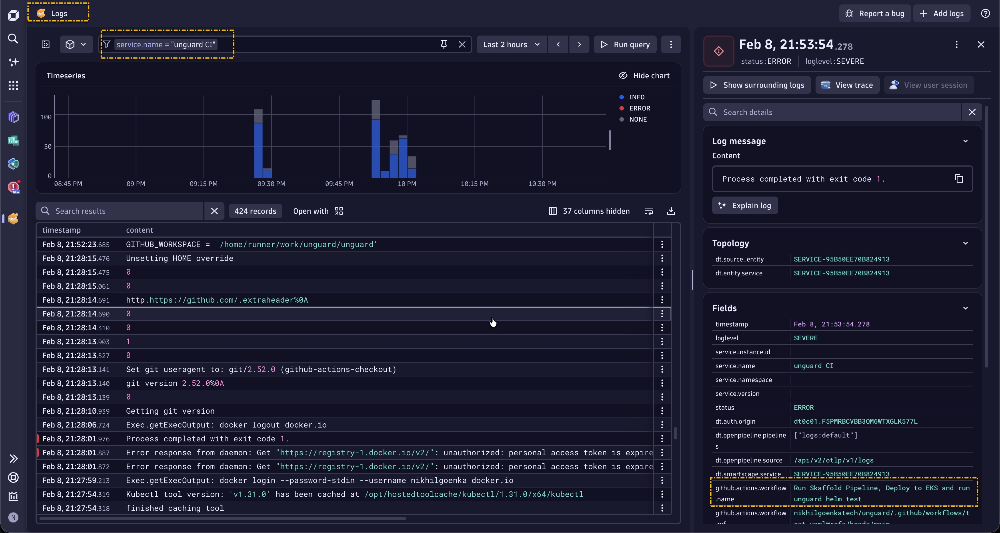
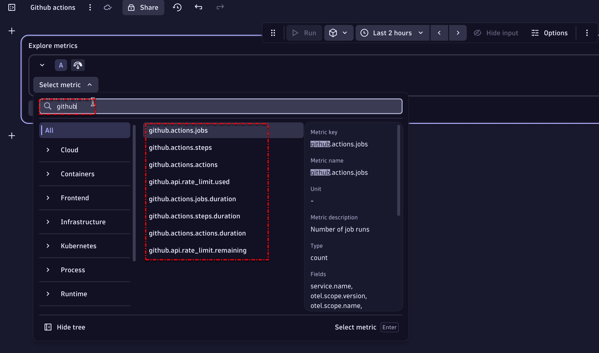

# OpenTelemetry with GitHub Actions — Instrumentation & Signal Enrichment

This document explains the OpenTelemetry instrumentation step used in the GitHub Actions workflow. It focuses on how the instrumentation action attaches contextual attributes to telemetry emitted by the runner and exports traces, metrics and logs to OTLP endpoints. The instrumentation helps correlate CI runs with application traces, logs and metrics.

Library used:
[plengauer/opentelemetry-github/actions/instrument/job@v5.21.0](https://github.com/plengauer/opentelemetry-github)

---

## Prerequisites

Set the following environment variables and secrets in your GitHub repository (or organization):

- OTLP endpoints and related variables
  - `OTEL_EXPORTER_OTLP_ENDPOINT`  
    Optional base OTLP endpoint (e.g., `https://<tenant>.live.dynatrace.com/`). If you use split endpoints, you can leave this blank and set the per-signal endpoints below.
  - `OTEL_EXPORTER_OTLP_TRACES_ENDPOINT`  
    Dynatrace OTLP traces endpoint, e.g. `https://<tenant>.live.dynatrace.com/api/v2/otlp/v1/traces`
  - `OTEL_EXPORTER_OTLP_METRICS_ENDPOINT`  
    Dynatrace OTLP metrics endpoint, e.g. `https://<tenant>.live.dynatrace.com/api/v2/otlp/v1/metrics`
  - `OTEL_EXPORTER_OTLP_LOGS_ENDPOINT`  
    Dynatrace OTLP logs endpoint, e.g. `https://<tenant>.live.dynatrace.com/api/v2/otlp/v1/logs`
  - `OTEL_EXPORTER_OTLP_HEADERS`  
    Authorization header used by the exporter, e.g. `Authorization=Api-Token <token>`  
    (Keep the token in GitHub Secrets; do not hardcode.)

- CI / release attributes (non-secrets)
  - `WORKFLOW_RUN_ID` — `${{ github.event.workflow_run.id }}`
  - `WORKFLOW_RUN_NAME` — `${{ github.event.workflow_run.name }}`
  - `RELEASE_ID`, `IMAGE_TAG_*` — commit-based tag or release version

Security note: store tokens in GitHub Secrets and not echo them to logs. Use the action's `secrets_to_redact` option to mask secrets from job logs.

---

## How the instrumentation step enriches telemetry

When the action runs it sets resource attributes and attaches semantic attributes to spans, logs and metrics emitted by the job and processes spawned by it. Key enrichment points:

- Resource attributes (applied at the job level)
  - `service.name` — from repo or artifact name (optionally `RELEASE_ID`)
  - `ci.provider` — GitHub Actions (set by the action)
  - `cicd.pipeline.run.id` / `ci.pipeline.id` — maps to `WORKFLOW_RUN_ID`
  - `cicd.pipeline.name` / `ci.pipeline.name` — maps to `WORKFLOW_RUN_NAME` or `${{ github.workflow }}`
  - `deployment.environment` — from inputs or branch rules (if you provide it)

- Span / log attributes (attached to CI spans or instrumented libraries)
  - `ci.artifact.version` — `RELEASE_ID` or image tag
  - `ci.artifact.name` — artifact/service name
  - `cicd.pipeline.run.url.full` / `ci.link` — link back to the GitHub Actions run
  - `net.host.name`, `host.id` — runner/host identifiers

- Metrics labels/tags
  - The action helps tag metrics emitted by the runner with `ci.*` and `service.*` attributes so you can filter metrics by pipeline, release, or environment.

Tip: add extra metadata (branch, commit id, PR number, author) to better filter and correlate telemetry.

---

## Example instrumentation step

```yaml
- uses: plengauer/opentelemetry-github/actions/instrument/job@v5.21.0
  env:
    OTLP_PROTOCOL: HTTPS
    WORKFLOW_RUN_ID: ${{ github.event.workflow_run.id }}
    WORKFLOW_RUN_NAME: ${{ github.event.workflow_run.name }}
    OTEL_EXPORTER_OTLP_ENDPOINT: ${{ secrets.OTEL_EXPORTER_OTLP_ENDPOINT }}
    OTEL_EXPORTER_OTLP_HEADERS: Authorization=Api-Token ${{ secrets.DYNATRACE_OTEL_API_TOKEN }}
    OTEL_EXPORTER_OTLP_METRICS_ENDPOINT: ${{ secrets.OTEL_EXPORTER_OTLP_METRICS_ENDPOINT }}
    OTEL_EXPORTER_OTLP_TRACES_ENDPOINT: ${{ secrets.OTEL_EXPORTER_OTLP_TRACES_ENDPOINT }}
    OTEL_EXPORTER_OTLP_LOGS_ENDPOINT: ${{ secrets.OTEL_EXPORTER_OTLP_LOGS_ENDPOINT }}
  with:
    cache: false
    secrets_to_redact: '${{ toJSON(secrets) }}'
```

Note: `secrets_to_redact` helps mask secrets from job logs. Keep it set to the JSON of secrets to minimize risk of leakage.

---

## Recommended attribute mappings

- `WORKFLOW_RUN_ID` -> `cicd.pipeline.run.id`
- `WORKFLOW_RUN_NAME` -> `cicd.pipeline.name`
- `RELEASE_ID` -> `ci.artifact.version` / `deployment.version`
- `IMAGE_TAG_*` -> `ci.artifact.version` (service-specific)
- `OTEL_EXPORTER_OTLP_HEADERS` -> used for exporter auth (not added to telemetry)

Add custom attributes in application instrumentation or CI wrapper scripts for branch, PR id, commit id, author, etc.

---

## Validation — what to look for in Dynatrace

**Traces**: CI job spans containing `cicd.pipeline.run.id` and `cicd.pipeline.name`.   

  
**Logs**: Job/runner logs with resource attributes correctly ingested at the logs endpoint.   


**Metrics**: Runner/job metrics with `ci.*` labels.   


---

## Best practices

- Use GitHub Secrets for tokens; never hardcode secrets.
- Limit token scopes and rotate regularly.
- Keep `secrets_to_redact` current.
- Consistently set `RELEASE_ID` / image tags across build and deploy steps for reliable correlation.
- Add branch/commit/PR metadata for richer filtering.