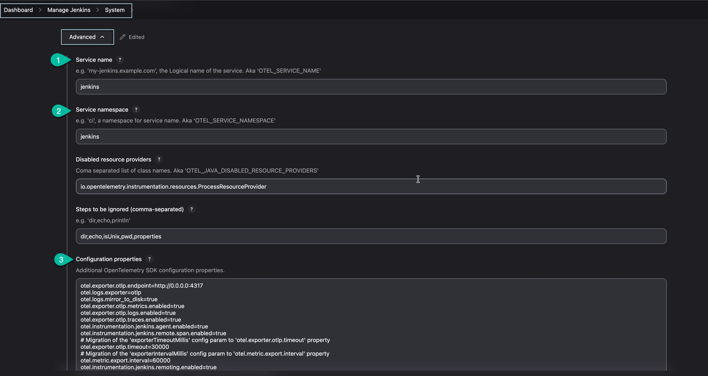
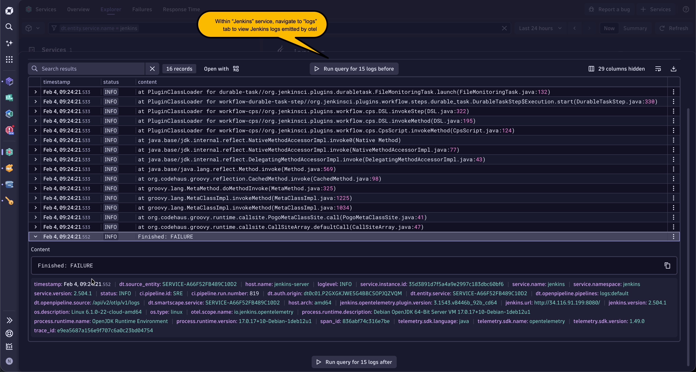
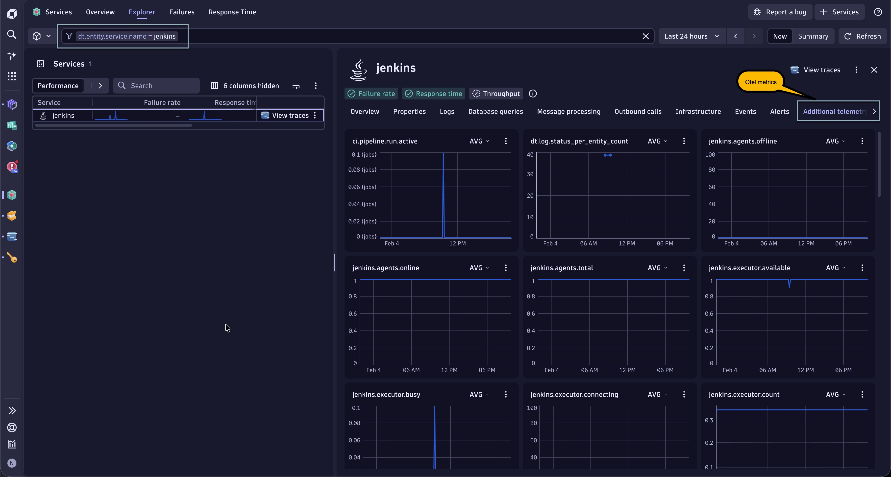
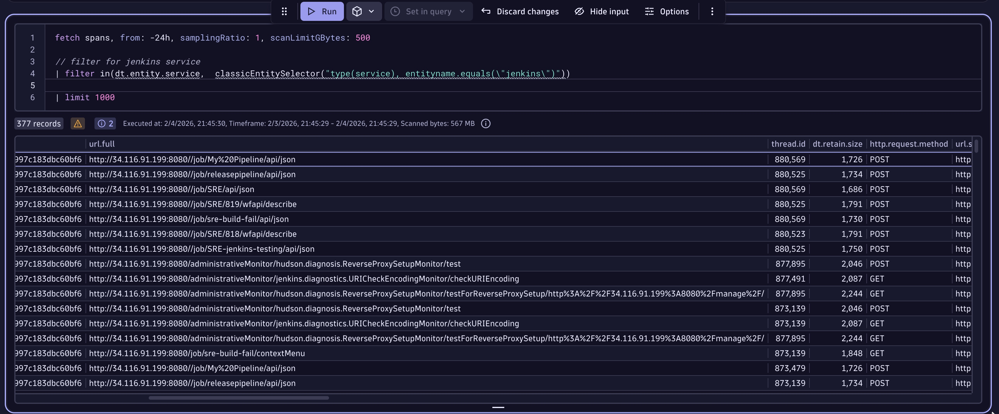

# Jenkins OpenTelemetry Log Ingestion with Dynatrace

This README outlines the steps to configure Jenkins for OpenTelemetry (OTel) log ingestion and trace monitoring with Dynatrace. Follow the instructions below to set up the environment and integrate Jenkins logs and traces into Dynatrace.

---

## Prerequisites

- **Dynatrace Tenant URL**: Ensure you have access to your Dynatrace tenant.
- **Access Token**: Generate a [Dynatrace access token](https://docs.dynatrace.com/docs/shortlink/installation-k8s-tokens-permissions) with **openTelemetryTrace.ingest, logs.ingest
, metrics.ingest** permissions.
- **Docker**: Installed and configured on the machine you intend to use for Otel Collector.
- **Jenkins**: Installed with administrative access.
- **OpenTelemetry Plugin**: [Opentelemtry plugin](https://plugins.jenkins.io/opentelemetry/)
 installed on Jenkins.

---

## Steps to Configure

### 1. **Set Up Dynatrace OpenTelemetry Collector on the host**

1. Pull the Dynatrace OpenTelemetry Collector Docker image:
    ```bash
    docker pull ghcr.io/dynatrace/dynatrace-otel-collector/dynatrace-otel-collector
    ```

2. Set the environment variables:
    ```bash
    export DT_ENDPOINT=https://<your-dynatrace-tenant>.dynatrace.apps.com/
    export API_TOKEN=<your-api-token>
    ```

3. Copy the [otel-config.yaml](./config/otel-config.yaml) file to the working directory.  

4. Lastly, run the Dynatrace OpenTelemetry Collector:
    ```bash
    docker run --rm -name dt-otelcol --env DT_ENDPOINT=$DT_ENDPOINT --env API_TOKEN=$API_TOKEN -p 4317:4317 -v $(pwd)/otel_config.yaml:/etc/otelcol/otel_config.yaml ghcr.io/dynatrace/dynatrace-otel-collector/dynatrace-otel-collector --config /etc/otelcol/otel_config.yaml
    ```
5. Run `docker ps -a` to confirm the dynatrace-collector is up and running.   

---

### 2. **Install and Configure OpenTelemetry Plugin in Jenkins**

1. Install the **OpenTelemetry Plugin** in Jenkins:
    - Navigate to `Manage Jenkins` > `Plugin Manager`.
    - Search for "OpenTelemetry Plugin" and install it.

2. Navigate to `Jenkins` > `Manage Jenkins` > `System` > `Advanced` to configure the otel plugin 

    ```
     Service Name: jenkins
     Service namespace: jenkins
    ```
    Setup below configuration properties so that Otel plugin emits the signals to Dynatrace-collector:   
    ```properties
    otel.exporter.otlp.endpoint=http://0.0.0.0:4317
    otel.logs.exporter=otlp
    otel.logs.mirror_to_disk=true
    otel.exporter.otlp.metrics.enabled=true
    otel.exporter.otlp.logs.enabled=true
    otel.exporter.otlp.traces.enabled=true
    ```

    Enable Jenkins instrumentation:
    ```properties
    otel.instrumentation.jenkins.agent.enabled=true
    otel.instrumentation.jenkins.remote.span.enabled=true
    ```
  
---

### 3. **Optional config parameters**

- Replace the `exporterTimeoutMillis` parameter with:
    ```properties
    otel.exporter.otlp.timeout=30000
    ```

- Update the metric export interval:
    ```properties
    otel.metric.export.interval=60000
    ```

---

### 4. **Verify Otel signals in Dynatrace**

- After a build is triggered, navigate to `Services` and search for `Jenkins' service.   

    - **Logs**: Go to the `Logs` section and see jenkins logs.  
      

    - **Metrics**: Go to the `Additional telemetry` section for the otel metrics.  
      

    - **Traces**: Navigate to the `Traces` section to view jenkins traces. Alternatively, leverage `DQL` to view the jenkins traces.   
     
---