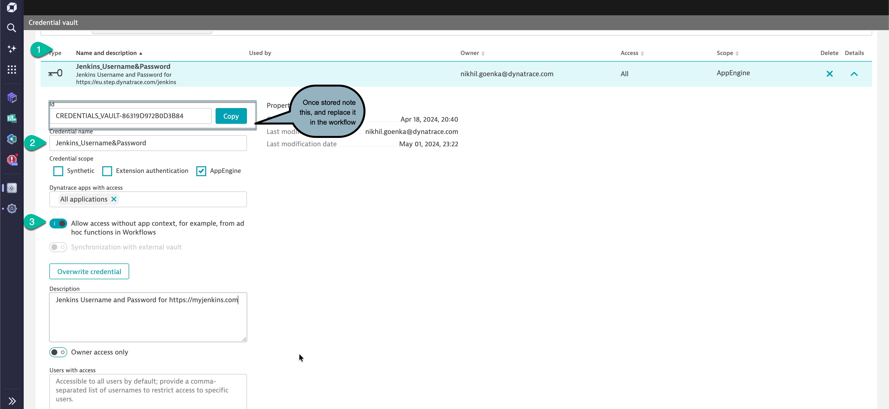

# Jenkins Metrics and Events Collection Workflow

This workflow is designed to collect various metrics and event data from Jenkins projects and pipelines, process it, and ingest the data into Dynatrace as business events. This allows teams to monitor Jenkins project activity, pipeline performance, repository storage usage, merge request cycle time, and contributor engagement within the Dynatrace environment.

## Workflow Overview

The workflow will:
1. **Fetch Project List**: Retrieve all Jenkins projects the authenticated user has access to.
2. **Gather Project Metrics**:
   - **Merge Request Cycle Time**: Average time taken for merge requests to move from creation to merging over the last 30 days.
   - **Repository Storage Usage**: Storage used by the repository.
   - **Active Contributors**: Total number of contributors.
3. **Collect Pipeline Data**:
   - Collect metrics for pipelines created in the last 60 minutes, including pipeline status, duration, and timestamps.
4. **Process Pipeline Jobs**:
   - For each pipeline, gather job-level data (status, duration, stage, etc.) for granular insights.

### Events and Metrics

- **Pipeline and Job Metrics**:
  - Pipeline Status, Duration, and Start/End Times
  - Job Status, Duration, and Stage

These metrics are ingested and accessible as business events.

## Requirements

1. **Jenkins Credentials**: The workflow requires a Jenkins API token stored in Dynatrace Credentials Vault with the name `Jenkins_Username&Password`.
   - This credential the username and password for the user to be able to make API calls to Jenkins.   

   To create this credential in Dynatrace:
   - Navigate to **Settings > Integration > Credentials** in your Dynatrace environment.
   - Add a new credential with the name **Jenkins_Username&Password** and Type **Username and Password**.  
   - Note the credential ID once stored (you will need to replace it in the workflow).  
   

## How to get started 

1. Setup a credentials on Dynatrace as illustrated in the image below.     
2. **Upload the workflow** as mentioned [here](https://docs.dynatrace.com/docs/shortlink/workflows-manage#upload-a-workflow-or-a-template)  
3. After the 1st run, it will pull build metrics for any release completed in the last one-hour and populate as **bizevents** and available on dashboard    
 
# Example Ingested Data  
## Project Metrics  
```json
        {
               "job-name": "SRE",
               "buildNumber": "829",
               "buildTimestamp": "1770293461",
               "status": "SUCCESS",
               "buildDuration": "79000",
               "buildUserId": "1",
               "buildUserName": "SRE",
               "buildResult":"FAILED",
               "event.type":"buildevents"
        };

```

## Pipeline Metrics  
```
fetch bizevents, scanLimitGBytes:-1
| filter event.provider == "JenkinsPipeline" and event.type == "pipeline"
```  

``` json
{
  "event.provider": "JenkinsMetrics",
  "event.type": "pipelineMetrics",
  "project-id": "123",
  "project-name": "example-project",
  "pipeline-id": "456",
  "pipeline-status": "success",
  "pipeline-duration": 300,
  "pipeline-created_at": "2024-10-25T12:00:00Z",
  "pipeline-updated_at": "2024-10-25T12:05:00Z"
}
```

## Job Metrics Event  
These are accessible via DQL  

```
fetch bizevents, scanLimitGBytes:-1
fetch bizevents
| filter event.type == "buildevents"
```  
``` json
{
      "timestamp": "2026-02-05T02:00:08.868000000+11:00",
      "event.provider": "unknown",
      "job-name": "SRE",
      "buildTimestamp": 1770154746272,
      "buildResult": "FAILURE",
      "buildUserName": "SRE",
      "event.type": "buildevents",
      "buildUserId": "admin",
      "event.id": "434cbe69-f4f5-4d55-93e0-4752c05b9e42",
      "event.kind": "BIZ_EVENT",
      "buildNumber": 818,
      "buildDuration": 3360,
      "status": "Failure",
      "dt.openpipeline.source": "/api/v2/bizevents/ingest",
      "dt.openpipeline.pipelines": [
        "bizevents:default"
      ]
    },
```


